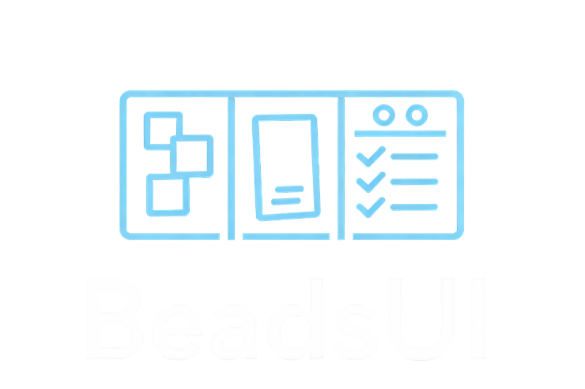
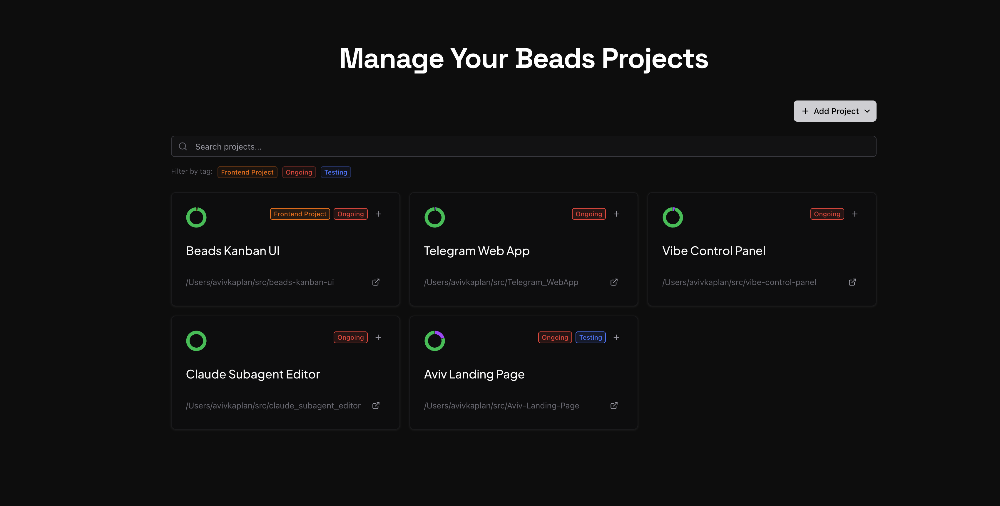
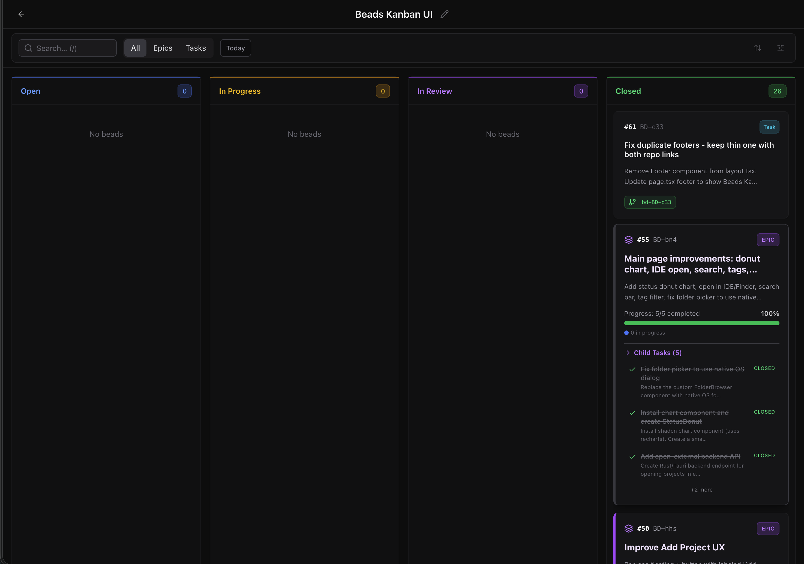
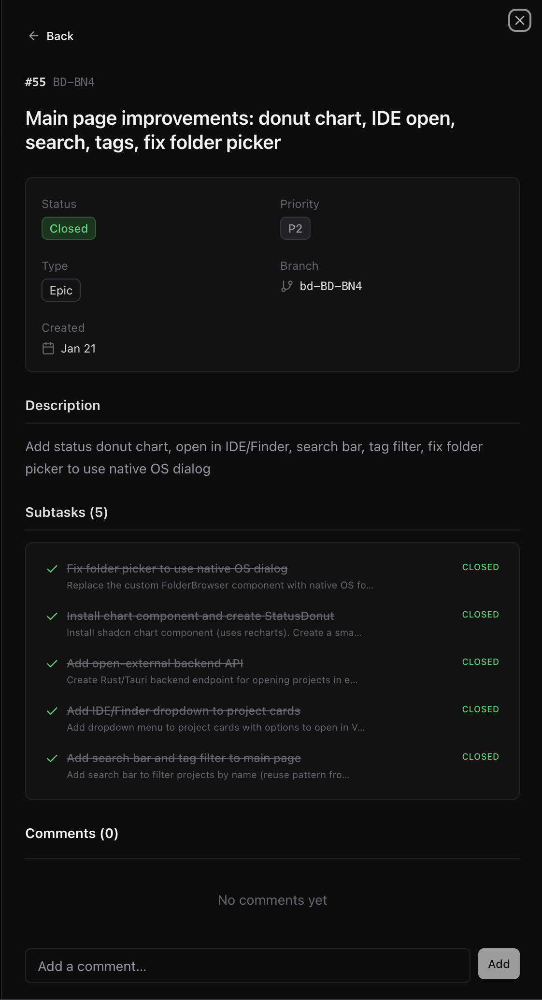
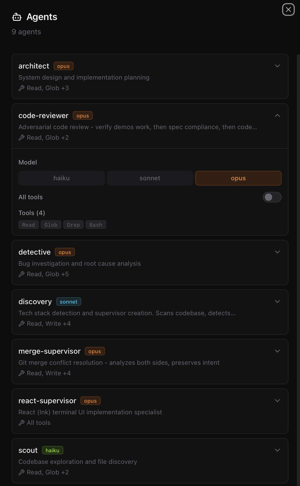

<p align="center">
  
</p>

<p align="center">
  A visual developer workspace for <a href="https://github.com/gastownhall/beads">Beads CLI</a>: Kanban boards, multi-project status, GitOps, epics, project memory, and agent configuration.
</p>

<p align="center">
  <a href="LICENSE"></a>
  <a href="https://github.com/Palmetto-Interactive-LLC/Sweetgrass/actions/workflows/ci.yml"></a>
  <a href="https://github.com/Palmetto-Interactive-LLC/Sweetgrass/issues"></a>
</p>

## About

Sweetgrass is Palmetto Interactive's heavily extended fork and continuation of the MIT-licensed Beads Kanban UI originally published at [AvivK5498/beads-web](https://github.com/AvivK5498/beads-web). GitHub no longer records this repository as a fork, so the lineage is documented here and in [NOTICE](NOTICE).

The original project provided a focused Kanban experience for Beads. Sweetgrass expands that foundation into a developer tools workspace with a Rust backend, multi-project dashboard, GitHub pull-request workflow, epic and dependency views, Beads memory editing, agent definition management, release packaging, and a Palmetto-maintained UI.

## See It in Action

**Dashboard** - All your projects in one place with status at a glance:


**Kanban Board** - Organize tasks across Open, In Progress, In Review, and Closed:


**Bead Details** - Dive into epics with full context and subtasks:


**Agents Panel** - View and configure agent definitions with model and tool controls:


## Key Features

- **Multi-project dashboard** - Manage Beads projects in one place with status charts, project tags, and fast navigation.
- **Kanban board** - Move work across Open, In Progress, In Review, and Closed with drag-to-update workflow.
- **GitOps workflow** - Create, view, and merge pull requests from the board, including CI status, merge conflicts, and auto-close on merge.
- **Epic support** - Group related tasks, show visual progress, list subtasks, and close epics when their children are complete.
- **Related tasks** - Display bidirectional "see also" links created through `bd dep relate`.
- **Beads memory panel** - Browse, search, edit, and archive project knowledge stored in `.beads/memory/knowledge.jsonl`.
- **Agents panel** - Inspect and edit `.claude/agents/*.md` definitions from the UI.
- **Real-time sync** - Watch Beads files on disk and update the board as project state changes.
- **Search and filters** - Use the floating toolbar for text search, task type, status, owner, today mode, and project tags.
- **Single-binary deployment** - Build the frontend and Rust backend into one production server.

## Quick Start

### Install From npm

Prerequisites:

```bash
brew install beads
```

Install and run:

```bash
npm install -g sweetgrass
sweetgrass
```

The server starts and opens your browser. On first run, the npm package downloads the platform binary from the matching GitHub Release.

### Build From Source

Prerequisites:

```bash
brew install beads
```

You also need Node.js 20+ and Rust.

```bash
git clone https://github.com/Palmetto-Interactive-LLC/Sweetgrass.git
cd Sweetgrass
npm install
npm run dev:full
```

Open `http://localhost:3007` and add a directory that contains a `.beads/` folder.

## How It Works

### Dashboard

1. Click **Add Project** and select a directory with a `.beads/` folder.
2. Review status charts, tags, and active work across all configured projects.
3. Open any project to work from its Kanban board.

### Kanban Board

1. Tasks are grouped by Beads status.
2. Drag cards between columns to update status.
3. Open a task to view details, comments, dependencies, related tasks, and epic children.

### GitOps

- Create pull requests directly from the bead detail panel.
- View CI status on cards and detail views.
- Merge PRs from the UI when checks and branch protections allow it.
- Auto-close linked beads after merge.
- Surface merge conflicts and worktree status without switching tools.

### Beads Memory

Sweetgrass can edit Beads project memory stored in `.beads/memory/knowledge.jsonl`. Agents can write entries through the stable capture API documented in [docs/memory-api.md](docs/memory-api.md), and the ready-made [AGENTS.md/CLAUDE.md snippet](docs/agents-snippet.md) shows how to add the API contract to a project.

### Agents

The Agents panel reads local `.claude/agents/*.md` definitions, displays model/tool metadata, and writes updates back to each agent file. It is intended for local developer workspaces; do not commit private agent definitions unless they are intentionally public.

## Development

Run frontend and backend together:

```bash
npm run dev:full
```

Or run them separately:

```bash
npm run dev
npm run server:dev
```

Run the main local gates:

```bash
npm run lint
npm run typecheck
npm run build
cd server && cargo clippy --release && cargo test --release
```

Production build:

```bash
npm run build
npm run server:build
./server/target/release/beads-server
```

The production server embeds the frontend and serves the app from a single Rust binary on port 3008.

## Open Source Lineage

- **Upstream UI:** [AvivK5498/beads-web](https://github.com/AvivK5498/beads-web), MIT licensed.
- **Core tracker:** [gastownhall/beads](https://github.com/gastownhall/beads), the Beads CLI and data model this UI wraps.
- **Palmetto continuation:** Sweetgrass keeps the upstream attribution while shipping Palmetto's extended dashboard, GitOps, epic, memory, agent, packaging, and release workflow work.

## Security

Please report suspected vulnerabilities through GitHub private vulnerability reporting. See [SECURITY.md](SECURITY.md).

## License

Sweetgrass is licensed under the MIT License. See [LICENSE](LICENSE) and [NOTICE](NOTICE).
